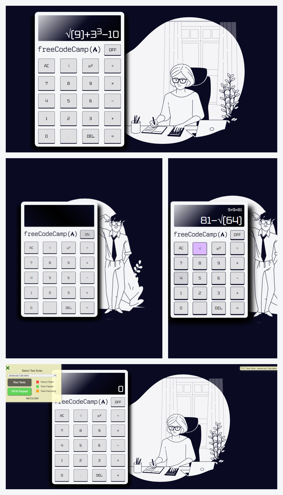

  
# Front End Development Libraries Project 4 - FreeCodeCamp

This is a JavaScript, and more precisely a React, calculator. It’s part of the required projects to complete FreeCodeCamp’s Front End Development Libraries certification.

## Table of contents

- [Overview](#overview)
  - [The challenge](#the-challenge)
  - [Screenshot](#screenshot)
  - [Links](#links)
- [My process](#my-process)
  - [Built with](#built-with)
  - [What I learned](#what-i-learned)
  - [Continued development](#continued-development)
  - [Useful resources](#useful-resources)
- [Author](#author)

## Overview

### The challenge

The goal is to build an app that is functionally similar to the [JavaScript calculator](https://javascript-calculator.freecodecamp.rocks/) given as an example.

All the tests passed (after turning on the calculator, obviously)!

The exact requirements:

1. The calculator should contain a clickable element containing an `=` (equal sign) with a corresponding `id="equals"`.
2. The calculator should contain 10 clickable elements containing one number each from 0-9, with the following corresponding IDs: `id="zero"`, `id="one"`, `id="two"`, `id="three"`, `id="four"`, `id="five"`, `id="six"`, `id="seven"`, `id="eight"`, and `id="nine"`.
3. The calculator should contain 4 clickable elements each containing one of the 4 primary mathematical operators with the following corresponding IDs: `id="add"`, `id="subtract"`, `id="multiply"`, `id="divide"`.
4. The calculator should contain a clickable element containing a `.` (decimal point) symbol with a corresponding `id="decimal"`.
5. The calculator should contain a clickable element with an `id="clear"`.
6. The calculator should contain an element to display values with a corresponding `id="display"`.
7. At any time, pressing the `clear` button clears the input and output values, and returns the calculator to its initialized state; 0 should be shown in the element with the id of `display`.
8. As I input numbers, I should be able to see the input in the element with the id of `display`.
9. In any order, I should be able to add, subtract, multiply and divide a chain of numbers of any length, and when I hit `=`, the correct result should be shown in the element with the id of `display`.
10. When inputting numbers, my calculator should not allow a number to begin with multiple zeros.
11. When the decimal element is clicked, a `.` should append to the currently displayed value; two `.` in one number should not be accepted.
12. I should be able to perform any operation (`+`, `-`, `*`, `/`) on numbers containing decimal points.
13. If 2 or more operators are entered consecutively, the operation performed should be the last operator entered (excluding the negative (`-`) sign). For example, if `5 + * 7 =` is entered, the result should be `35` (i.e. `5 * 7`); if `5 * - 5 =` is entered, the result should be `-25` (i.e. `5 * (-5)`).
14. Pressing an operator immediately following `=` should start a new calculation that operates on the result of the previous evaluation.
15. My calculator should have several decimal places of precision when it comes to rounding (note that there is no exact standard, but you should be able to handle calculations like `2 / 7` with reasonable precision to at least 4 decimal places).

### Screenshot



### Links

- Challenge URL: [Challenge URL](https://www.freecodecamp.org/learn/front-end-development-libraries/front-end-development-libraries-projects/build-a-javascript-calculator)
- Live Site URL: [Live site URL](https://leo-code-ca.github.io/javascript-calculator/)

## My process

### Built with

- React
- BEM methodology
- CSS custom properties

### What I learned

One more time, I'm really happy of this new Free Code Camp project! I remember when I just finished their front-end libraries course and had a look at the projects I was about to start, I got kind of scared by that one! However, when I started working on it a few days ago, my mindset was really different. I was feeling like I could do it, and that's extremely pleasant!

First, I'm glad to have used React because it's definitely one of my favorite ways to use JavaScript! I still don't have much experience with it so it was an excellent exercise for me. I used for the first time in a real project the `useReducer` hook and it worked like a charm! I love it!  
```
export  default  function  reducer(state, action) {
	
	switch (action.type) {

        case "RESET":
            return {
                main: "0",
                previous: "",
                math: "0"
            };
        case "DELETE":
            const deleteLast = state.main === "0" || state.main.length === 1 ? "0" : state.main.slice(0, state.main.length - 1);
            return {
                ...state,
                main: deleteLast,
                math: mathFormated(deleteLast)
            }
        case "SQRT":
            const sqrt = state.main === "0" ? action.content + "()"
            : action.matches % 2 == "0" ? state.main + action.content + "()" 
            : state.main + "sqrtend";
            return {
                ...state,
                main: sqrt,
                math: mathFormated(sqrt)
            }
        case "POW":
            const pow = action.matches % 2 == "0" ? state.main + "**" : state.main + "powerend";
            return {
                ...state,
                main: pow,
                math: mathFormated(pow)
            }
        case "EQUAL":
            const math = Function("return " + state.math)()
            const equal = math.toString().slice(0, 8);
            return {
                main: equal,
                previous: `${state.main} = ${equal}`,
                math: equal
            }
        case "DISPLAY": 
            const display = state.main === "0" ? action.content
            : state.main[state.main.length - 1] === ")" ? state.main.slice(0, state.main.length - 1) + action.content + ")"
            : state.main + action.content;
            return {
                ...state,
                main: display,
                math: mathFormated(display)
            }
        default:
            throw new Error("action type not reconized");
    }
}   
```
It was also a good opportunity for me to refresh my memory of the RegEx syntax as I hadn't used it for quite a while! Globally, I found myself being pretty efficient in the development of that project. I haven't spent too much time on little things that don't really deserve it as I usually tend to do so that's good. I really tried to focus on the functionalities.

Let's summarize what I've learned:

 - `useReducer` hook in an actual project
 - combine `useReducer` and `useState`in the same project
 - manage a complex state (object)
 - calculate a formula stored in a string with the Function constructor
 - use the iterator retuned by `matchAll()`to determine the number of occurrence of a RegEx in a string 
 - work with RegEx to format user's input in an understandable way for JavaScript

### Continued development

Even if React becomes less and less mysterious to me, I'm definitely far from mastering it! I definitely still struggle to find the right way to divide the UI in different components, even after following step by step the documentation. I'm never sure about how many components I should have and what should populate them or at the opposite, be a component by itself. 

I have the same problem with figuring out what state to create! I know that I need to have a less as I can, the minimal reproduction of the UI, as React developers say but it's not easy at all for me. Sometimes, I feel like I have too many or at the opposite, like in that calculator project, I'm wondering if I shouldn't have added one or two more. I guess I'll become better at that with time and practice.  

### Useful resources

- [matchAll() method](https://www.w3schools.com/jsref/dom_obj_audio.asp) - I definitely agree with everyone out there claiming that MDN is probably the best documentation available but I still have had a hard time going through most of their articles. They are so complex that they become almost scaring sometimes! I'm trying to slowly get used to them and that particular one what really helpful for my project.  
- [useState and useReducer](https://www.youtube.com/channel/UCw3LzfWsv-xXTFI6Q4Y4SwQ) - I discovered Nader's YouTube channel a few months ago and since then I've been watching tons of his videos about JavaScript concepts that weren't really clear in my mind! It has helped me a lot, especially because after the course, he encourages you to get some practice with some cool exercises. Totally worth checking that out!
- [the Function construcor](https://stackoverflow.com/questions/6479236/calculate-string-value-in-javascript-not-using-eval) - I had strictly no idea if it was even possible to use strings to do math calculations, actually it is! This stack overflow post helped me to understand how to implement that and... looks like it worked!

## Author

- GitHub - [@Leo-Code-CA](https://github.com/Leo-Code-CA)
- FreeCodeCamp - [@Leo-code](https://www.freecodecamp.org/Leo-code)
